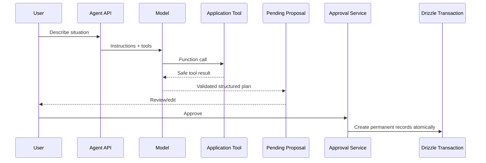

# Sonae

Prepared for what’s next.

Sonae means being prepared and organized. It turns natural-language life situations into pending plans. A user describes a move, trip, purchase return, appointment, renewal, follow-up, or generic responsibility; the agent drafts a life event with tasks, reminders, deadlines, and waiting items; the user reviews and approves the proposal before anything is permanently saved.

## Architecture

The app uses one focused server-side agent:

- `AgentProvider`: `MockAgentProvider` for local/demo runs, `OpenAIAgentProvider` for the Responses API.
- `AgentToolRegistry`: validates tool arguments with Zod, executes authorized read/proposal tools, records duration and success/failure.
- `ProposalBuilder`: maintains temporary proposal state and prevents duplicate finalization.
- `DataRepository`: `MemoryDataRepository` for demo/test, `DrizzleDataRepository` for Neon/PostgreSQL.
- `AuthProvider`: `DemoAuthProvider` for demo, `BetterAuthProvider` for production auth.

Application services depend on provider interfaces selected in `src/server/providers/index.ts`.



## Agent Details

Prompt version is `sonae-v1` and is recorded on every agent run. Agent states are enforced as:

`created -> running -> awaiting_clarification | ready_for_review | failed`

`awaiting_clarification -> running | expired`

`ready_for_review -> approved | rejected | expired`

Tools include current datetime, preferences, active events, upcoming tasks, waiting items, date resolution, temporary proposal mutations, clarification, and finalization. No tool permanently creates, completes, deletes, sends, purchases, cancels, or submits anything.

## Environment

Demo mode works without external credentials:

```bash
APP_MODE=demo
DATA_PROVIDER=memory
AI_PROVIDER=mock
AUTH_PROVIDER=demo

DATABASE_URL=
BETTER_AUTH_SECRET=
BETTER_AUTH_URL=http://localhost:3000
OPENAI_API_KEY=
OPENAI_MODEL=gpt-5-mini
AGENT_MAX_STEPS=12
AGENT_TIMEOUT_MS=20000
AGENT_CLARIFICATION_TTL_HOURS=168
CRON_SECRET=

# Optional reminder delivery
APP_BASE_URL=
QSTASH_TOKEN=
QSTASH_CURRENT_SIGNING_KEY=
QSTASH_NEXT_SIGNING_KEY=
RESEND_API_KEY=
RESEND_FROM_EMAIL=
```

Production mode fails clearly unless real providers are configured:

- Neon/Postgres: `DATA_PROVIDER=postgres`, `DATABASE_URL`
- Better Auth: `AUTH_PROVIDER=better-auth`, `BETTER_AUTH_SECRET`, `BETTER_AUTH_URL`
- OpenAI: `AI_PROVIDER=openai`, `OPENAI_API_KEY`, `OPENAI_MODEL`

Reminder delivery is optional in local/demo mode. Without keys, reminders are still created and marked as pending delivery. After keys are added, the reminder cron can queue pending reminders.

## Reminder Delivery

Sonae uses QStash for precise delayed jobs and Resend for email. This is a good side-project setup because QStash handles durable scheduling and retries without running a separate worker process, while Resend keeps email sending simple and cheap at low volume.

Flow:

1. A user creates a reminder or approves an agent proposal with reminders.
2. Sonae stores the reminder, resolves the notification email, and queues a QStash message for the exact `remindAt` timestamp.
3. QStash calls `POST /api/reminders/deliver` when the reminder is due.
4. The worker verifies the request, checks `deliveryVersion` for stale edits, sends email with Resend, and marks the reminder `sent`.
5. `GET /api/cron/reminders` runs daily as a fallback. It queues pending future reminders within QStash's one-year scheduling window and directly attempts due reminders that were missed.

Required env vars for live email reminders:

- `APP_BASE_URL`: deployed app URL, for example `https://sonae.example.com`
- `QSTASH_TOKEN`: Upstash QStash token
- `QSTASH_CURRENT_SIGNING_KEY` and `QSTASH_NEXT_SIGNING_KEY`: QStash webhook verification keys
- `RESEND_API_KEY`: Resend API key
- `RESEND_FROM_EMAIL`: verified sender, for example `Sonae <reminders@yourdomain.com>`
- `CRON_SECRET`: shared bearer secret for Vercel Cron and the fallback worker auth path

Run the migration before enabling Postgres-backed reminder delivery:

```bash
npm run db:migrate
```

## Approval Boundary

The agent only creates pending proposals. Approval validates the user-edited proposal again, verifies ownership/state, prevents duplicate approval, and creates the life event, tasks, reminders, waiting items, and activity logs in one repository operation. Clarification-pending proposals cannot be approved.

## Commands

```bash
npm run dev
npm run typecheck
npm run lint
npm test
npm run eval:agent
npm run build
npm run e2e
npm run db:generate
npm run db:migrate
npm run db:seed
```

`npm run eval:agent` runs 25 deterministic mock-agent eval cases and does not call OpenAI.

## Adding Agent Capabilities

To add a tool, define its Zod schema and executor in `src/server/agent/tools.ts`, expose a strict Responses function definition, and add unit/eval coverage. To add a category, update `proposalCategorySchema`, the mock scenario builder, prompt examples when useful, and the eval suite.
